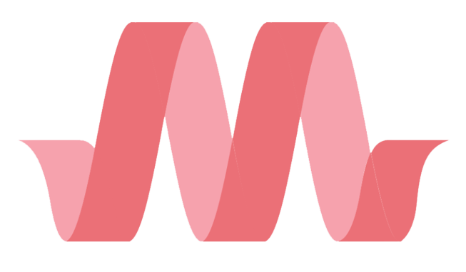
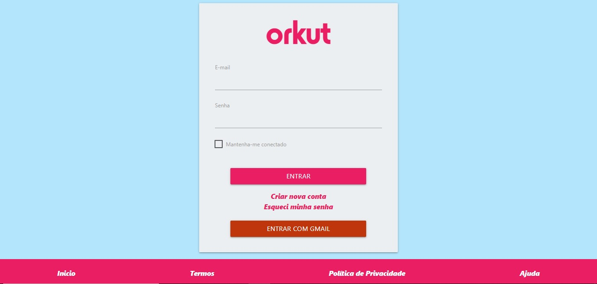

# 
MATERALIZE

   
   <h1>SUMÁRIO</h1>

-  [TO DO LIST](#to-do-list)
-  [TECNOLOGIAS APLICADAS](#tecnologias-aplicadas)
-  [FERRAMENTAS](#ferramentas)
-  [CONCEITOS APLICADOS](#conceitos-aplicados)
-  [COLABORADORES](#colaboradores)
   

   
   <h1>SOBRE</h1>   

Esse projeto foi proposto pelo professor de Front-End com
objetivo de projetarmos um site de login e desenvolver
utilizando o framework sorteado durante a aula (Metaralize)

   
   <h1>TO DO LIST:</h1>   

- [x] Prototipar um site de Login
- [x] Desenvolver usando o framework sorteado
- [x] Implementar o clean code
- [x] Tornar o projeto responsivo

| MOBILE                                     |             DESKTOP             |
| :----------------------------------------- | :-----------------------------: |
|  |  |

   
   <h1>TECNOLOGIAS APLICADAS</h1>   

- HTML5
- CSS3
- FRAMEWORK

<h1>FERRAMENTAS</h1> 
       

   
   <h1>CONCEITOS APLICADOS</h1>   

- FRAMEWORK
- CDN
- RESPOSIVIDADE

   
   <h1>COLABORADORES</h1>   

| NOMES                                                                                                                                                                                      |                                               GITHUB                                               |                                       FOTO                                        |
| :----------------------------------------------------------------------------------------------------------------------------------------------------------------------------------------- | :------------------------------------------------------------------------------------------------: | :-------------------------------------------------------------------------------: |
|  |  | </a>  |
|  |      | </a> |
|    |  | </a> 
